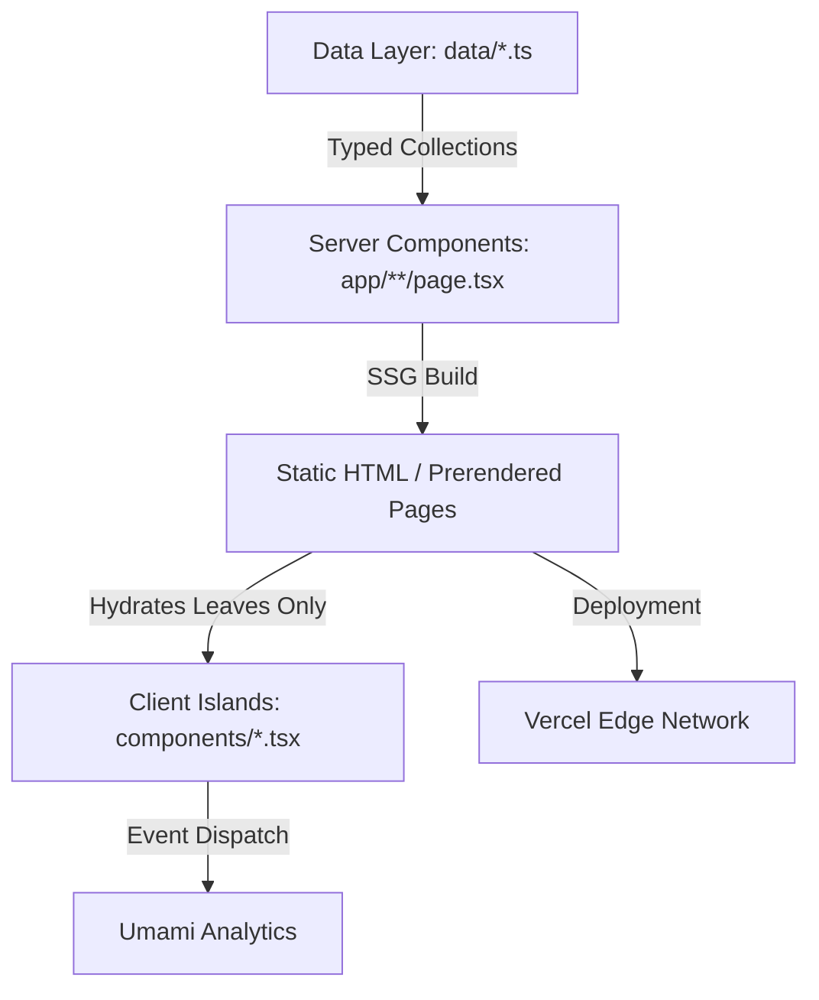

# Portfolio

Personal portfolio and technical writing showcase for Aditya Gupta, built with Next.js 15, React 19, TypeScript, and Tailwind CSS.

**Live Site:** [https://adityaguptadev.me](https://adityaguptadev.me)

---

## Overview

This repository contains the source code for my personal portfolio. It is designed as a fast, fully static website that highlights full-stack engineering projects, work experience, technical skills, and technical articles published on Medium.

The architecture emphasizes static prerendering, minimal client-side JavaScript, strong type safety, and a unified design system supporting dark and light themes without layout shifts or flash of unstyled content.

---

## Tech Stack

| Category | Technology |
|---|---|
| **Framework** | Next.js 15.3 (App Router) |
| **UI Library** | React 19.1 |
| **Language** | TypeScript 6.0 |
| **Styling** | Tailwind CSS 3.4, PostCSS, Custom CSS Keyframes |
| **Theming** | `next-themes` (Class-based, Light/Dark mode) |
| **Icons** | `boxicons` (font glyphs), `simple-icons` (SVG paths) |
| **Typography** | Neue Haas Grotesk (Local font with system fallbacks) |
| **Analytics** | Umami Analytics (Custom event & scroll depth tracking) |
| **CI** | GitHub Actions |
| **Hosting & CD** | Vercel |

---

## Architecture & Design Principles



### 1. Static Site Generation (SSG) by Default
All routes are prerendered as static HTML at build time (`output: export` compatible App Router pattern). Dynamic project pages (`/projects/[slug]`) implement `generateStaticParams()` to precompute paths from the project data layer.

### 2. Client Islands Pattern
Server Components are utilized across all layout and route containers to minimize client bundle overhead (~102 kB shared initial JS). Client-side execution (`'use client'`) is isolated to specific interactive leaves:
- Header theme toggle (`next-themes`)
- Copy-to-clipboard interactions (`CopyButton.tsx`)
- Accordion expand/collapse (`WorkEntryCard.tsx`)
- Scroll reveal animations (`useInView.ts` + `AnimatedSection.tsx`)
- Viewport scroll depth tracking (`ScrollDepthTracker.tsx`)

### 3. Decoupled Data Layer
Content is separated from presentation logic. Data files in `data/` act as typed single sources of truth:
- `data/projects.ts`: Project metadata, live/repository URLs, tech stack tags, status flags, and descriptions.
- `data/blog.ts`: Article metadata, Medium external links, read times, published dates, tags, and featured flags.
- `data/work.ts`: Work history, roles, dates, locations, technology tags, and key accomplishments.
- `data/skills.ts`: Categorized technical skill sets.

### 4. Design System & Icon Alignment
- **Theme Handling:** Defaults to `light` mode with `dark` mode support. The `disableTransitionOnChange` prop prevents CSS transition flashes during theme switches.
- **Icon Sizing Standardization:** Boxicons font glyphs (`text-xl`, 20px bounding box) are optically paired with Simple Icons SVGs wrapped in `w-5 h-5` flex containers with `w-[14px] h-[14px]` paths to maintain consistent visual alignment across all surfaces.
- **Accessibility:** Includes skip-to-content links, explicit ARIA attributes, semantic landmarks, and full respect for `prefers-reduced-motion` preferences.

### 5. SEO & Structured Data
- Root layout defines base OpenGraph, Twitter card metadata, and Schema.org `Person` JSON-LD structured data.
- Project detail routes dynamically inject canonical URLs and OpenGraph tags via `generateMetadata()`.
- Dynamic sitemap (`app/sitemap.ts`) and crawler directives (`app/robots.ts`) automatically map all static pages and project slugs.

---

## Project Structure

```
portfolio/
├── .github/
│   └── workflows/
│       └── ci.yml               # GitHub Actions CI workflow
├── app/                         # Next.js App Router
│   ├── layout.tsx               # Root layout, ThemeProvider, Header, Footer, JSON-LD
│   ├── page.tsx                 # Home page (Hero, Tech Strip, Featured Projects, Work)
│   ├── globals.css              # Global styles, Tailwind directives, dark mode overrides
│   ├── sitemap.ts               # Dynamic sitemap generation
│   ├── robots.ts                # Robots.txt crawler configuration
│   ├── not-found.tsx            # Custom 404 handler
│   ├── blog/
│   │   └── page.tsx             # Curated writing showcase linked to Medium
│   ├── projects/
│   │   ├── page.tsx             # Project index sorted by year
│   │   └── [slug]/
│   │       └── page.tsx         # Dynamic SSG project detail view
│   ├── resume/
│   │   └── page.tsx             # PDF viewer and download links
│   ├── skills/
│   │   └── page.tsx             # Categorized skill directory
│   └── work/
│       └── page.tsx             # Work history with expandable entries
├── components/                  # Reusable UI components
│   ├── AnimatedSection.tsx      # Viewport reveal wrapper
│   ├── CopyButton.tsx           # Clipboard copy button with status indicator
│   ├── ExperienceSection.tsx    # Experience preview block
│   ├── FeaturedProjects.tsx     # Homepage featured projects grid
│   ├── Footer.tsx               # Site footer with navigation and social links
│   ├── Header.tsx               # Sticky navigation header with theme switch
│   ├── PageContainer.tsx        # Standard width and padding layout wrapper
│   ├── ScrollDepthTracker.tsx   # Milestone scroll depth tracking component
│   ├── StatusBadge.tsx          # Project status indicator (Live, In Progress, Archived)
│   ├── TechStrip.tsx            # Technology pill strip with link to skills
│   ├── ThemeProvider.tsx        # Next-themes client wrapper
│   ├── TrackedLink.tsx          # Client link with event tracking
│   └── WorkEntryCard.tsx        # Expandable work experience row
├── data/                        # Typed data collections (Source of Truth)
│   ├── blog.ts
│   ├── projects.ts
│   ├── skills.ts
│   └── work.ts
├── fonts/                       # Local font assets (Neue Haas Grotesk)
├── hooks/                       # Custom React hooks (useInView)
├── lib/                         # Utilities (analytics wrapper)
├── public/                      # Static assets and project imagery
├── types/                       # Global type definitions (Umami window augmentation)
├── .eslintrc.json               # ESLint configuration (next/core-web-vitals)
├── next.config.mjs              # Next.js configuration
├── package.json                 # Project dependencies and npm scripts
├── tailwind.config.js           # Tailwind CSS configuration
└── tsconfig.json                # TypeScript compiler configuration
```

---

## Getting Started

### Prerequisites

- Node.js 18.18.0 or later (Node.js 20 LTS recommended)
- npm 9.0.0 or later

### Installation

1. Clone the repository:
   ```bash
   git clone https://github.com/aditya-gupta-me/portfolio.git
   cd portfolio
   ```

2. Install dependencies:
   ```bash
   npm ci
   ```

3. Set up environment variables (optional for local development):
   Create a `.env.local` file in the root directory:
   ```bash
   cp .env.example .env.local 2>/dev/null || touch .env.local
   ```
   Add the following configuration if embedding a Google Drive resume:
   ```env
   NEXT_PUBLIC_RESUME_DRIVE_ID=your_google_drive_file_id
   ```

4. Start the local development server:
   ```bash
   npm run dev
   ```
   Open [http://localhost:3000](http://localhost:3000) in your browser.

---

## Available Scripts

| Command | Description |
|---|---|
| `npm run dev` | Starts the Next.js development server with hot reloading |
| `npm run build` | Compiles the project and generates static production pages |
| `npm run start` | Starts the Next.js production server locally |
| `npm run lint` | Runs ESLint against all source files using `next/core-web-vitals` |
| `npm run typecheck` | Runs the TypeScript compiler (`tsc --noEmit`) to validate types |

---

## Environment Variables

| Variable | Required | Description |
|---|---|---|
| `NEXT_PUBLIC_RESUME_DRIVE_ID` | No | Google Drive file ID used to embed the PDF preview on `/resume`. If omitted, the page renders a fallback message with direct links. |

---

## Continuous Integration & Deployment

### Continuous Integration (GitHub Actions)
A GitHub Actions workflow (`.github/workflows/ci.yml`) runs automatically on:
- All pull requests targeting `main`
- All direct pushes to `main`

The pipeline executes the following checks in an `ubuntu-latest` container:
1. `npm ci` — Clean dependency installation against `package-lock.json`
2. `npm run lint` — ESLint validation using Next.js core web vitals rules
3. `npm run typecheck` — TypeScript type checking without emit
4. `npm run build` — Production compilation and static page generation verification

### Continuous Deployment (Vercel)
Deployment is decoupled from GitHub Actions and handled natively by Vercel:
- **Preview Deployments:** Automatically created for every pull request.
- **Production Deployments:** Triggered automatically when commits are merged into the `main` branch.

---

## License

This project is open source and available under the [MIT License](LICENSE).
